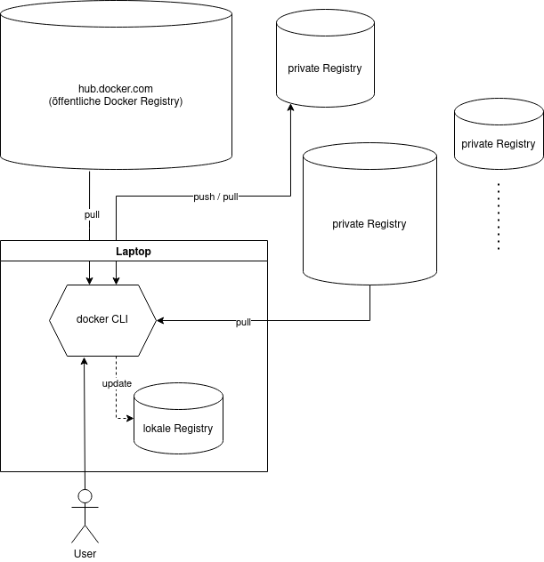

# Kubernetes Workshop

---

# Vortragende

+++

- Sandro Koll

+++

- Pascal Rimann

+++

## Teilnehmer

+++

- Kurze Vorstellung
- Erfahrungen?
    - Docker
    - Kubernetes
- Erwartungen?

---

# Tag 1

+++

<!-- .slide: style="text-align: left;"> -->
## Agenda
1. Setup
1. Container
1. Monolithen vs. Microservices
1. Container-Orchestrierung
1. Prinzipien hinter Kubernetes 

---

<!-- .slide: style="text-align: left;"> -->
## Setup

```sh
sudo usermod -aG docker ${USER}
git clone https://github.com/x-cellent/k8s-workshop.git
cd k8s-workshop
make
mkdir -p ~/bin
mv bin/w6p ~/bin/
echo "export PATH=$PATH:~/bin" >> ~/.bashrc
source ~/.bashrc
w6p
```

+++

<!-- .slide: style="text-align: left;"> -->
## Output

```sh
Usage:
  w6p [flags]
  w6p [command]

Available Commands:
  cluster     Runs the workshop cluster or exercises
  exercise    Runs the given exercise
  help        Help about any command
  install     Installs tools on local machine
  slides      Shows or exports workshop slides

Flags:
  -h, --help   help for w6p
```

+++

<!-- .slide: style="text-align: left;"> -->
## Was ist w6p?

Go CLI executable ausschließlich für diesen Workshop  <!-- .element: class="fragment" data-fragment-index="1" -->
- w6p install TOOL  <!-- .element: class="fragment" data-fragment-index="2" -->
    - lokale Installation von gebräuchlichen k8s Tools  <!-- .element: class="fragment" data-fragment-index="2" -->
- w6p exercise CONTEXT -n NUMBER  <!-- .element: class="fragment" data-fragment-index="3" -->
    - Startet Aufgaben aus dem jeweiligen Kontext (docker oder k8s)  <!-- .element: class="fragment" data-fragment-index="3" -->
- w6p cluster  <!-- .element: class="fragment" data-fragment-index="4" -->
    - Startet/stoppt Single-Node Kubernetes Cluster in Container  <!-- .element: class="fragment" data-fragment-index="4" -->

+++

<!-- .slide: style="text-align: left;"> -->
- w6p slides
    - Startet Webserver Container, der die Workshop Slides hosted
    - erreichbar unter localhost:8080

---

<!-- .slide: style="text-align: left;"> -->
## Container

Software wird schon seit Jahrzehnten in Archive oder Single-Binaries verpackt
- Einfache Auslieferung  <!-- .element: class="fragment" data-fragment-index="1" -->
- Einfache Verteilung  <!-- .element: class="fragment" data-fragment-index="2" -->

+++

<!-- .slide: style="text-align: left;"> -->
## Aber
- Installation notwendig  <!-- .element: class="fragment" data-fragment-index="1" -->
- Dependency Hell  <!-- .element: class="fragment" data-fragment-index="2" -->
- No cross platform functionality  <!-- .element: class="fragment" data-fragment-index="3" -->

+++

<!-- .slide: style="text-align: left;"> -->
## Lösung
- Verpacken der Software mitsamt aller Dependencies (Image)  <!-- .element: class="fragment" data-fragment-index="1" -->
    - Nichts darüber hinaus (Betriebssytem notwendig?)  <!-- .element: class="fragment" data-fragment-index="2" -->
- Container-Runtime für alle Plattformen  <!-- .element: class="fragment" data-fragment-index="3" -->

+++

<!-- .slide: style="text-align: left;"> -->
## Umsetzung
- Linux  <!-- .element: class="fragment" data-fragment-index="1" -->
- Idee: Container teilen sich Kernel  <!-- .element: class="fragment" data-fragment-index="2" -->
- LXC: basierend auf Kernel-Funktionalitäten  <!-- .element: class="fragment" data-fragment-index="3" -->
    - namespaces  <!-- .element: class="fragment" data-fragment-index="4" -->
    - cgroups  <!-- .element: class="fragment" data-fragment-index="5" -->
- Docker erweitert LXC um  <!-- .element: class="fragment" data-fragment-index="6" -->
    - ...CLI zum Starten und Verwalten von Containern  <!-- .element: class="fragment" data-fragment-index="6" -->
    - Image Registry  <!-- .element: class="fragment" data-fragment-index="7" -->
    - Networking  <!-- .element: class="fragment" data-fragment-index="8" -->
    - docker-compose  <!-- .element: class="fragment" data-fragment-index="9" -->

<aside class="notes">
  Kein komplettes OS installiert wird
  Kernel vom Host System wird geteilt
    - namespaces: Isolierung Prozesse (Ressourcen-Sichtbarkeit), Microservice-Architekturstil
    - cgroups: Resource-Limits für Prozesse (CPU, Memory); CPU, Disk und Netzwerk-Ressourcen Aufteilung
</aside>

---

<!-- .slide: style="text-align: left;"> -->
## Vorteile Container
1. Geringere Größe <!-- .element: class="fragment" data-fragment-index="1" -->
1. Erhöhte Sicherheit <!-- .element: class="fragment" data-fragment-index="2" -->
1. Funktional auf allen Systemen <!-- .element: class="fragment" data-fragment-index="3" -->
1. Immutable <!-- .element: class="fragment" data-fragment-index="4" -->
    - Damit Baukastenprinzip möglich (DRY) <!-- .element: class="fragment" data-fragment-index="5" -->

<aside class="notes">
  Beinhaltet kein komplettes OS =>
  Ubuntu Image ca. 72.8 MB
  Alpine ca. 5.57 MB
  Busybox ca. 1.24 MB
</aside>

+++

<!-- .slide: style="text-align: left;"> -->
## Vorteile gegenüber VMs
1. Geringere Größe <!-- .element: class="fragment" data-fragment-index="1" -->
1. Geringerer Ressourcenverbrauch <!-- .element: class="fragment" data-fragment-index="2" -->
1. Viel schnellere Startup-Zeiten <!-- .element: class="fragment" data-fragment-index="3" -->
1. Auch geeignet für Entwicklung und Test <!-- .element: class="fragment" data-fragment-index="4" -->

<aside class="notes">
  Ein Rechner kann deutlich mehr Anwendungen als VMs hosten
</aside>

+++

<!-- .slide: style="text-align: left;"> -->
## Nachteile gegenüber VMs
1. Geringere Sicherheit <!-- .element: class="fragment" data-fragment-index="1" -->
1. Keine echte Trennung <!-- .element: class="fragment" data-fragment-index="2" -->
    - z.B. kein Block-Storage möglich <!-- .element: class="fragment" data-fragment-index="2" -->

Container und VMs schließen sich aber nicht gegenseitig aus <!-- .element: class="fragment" data-fragment-index="3" -->

---

<!-- .slide: style="text-align: left;"> -->
## Docker Komponenten
1. Image <!-- .element: class="fragment" data-fragment-index="1" -->
    - Layer <!-- .element: class="fragment" data-fragment-index="2" -->
    - Dockerfile <!-- .element: class="fragment" data-fragment-index="3" -->
1. Container <!-- .element: class="fragment" data-fragment-index="4" -->
1. Image Registry <!-- .element: class="fragment" data-fragment-index="5" -->

+++

<!-- .slide: style="text-align: left;"> -->
## Dockerfile
- [Referenz](https://docs.docker.com/engine/reference/builder/)
- Image-*Rezept* mit u.a. folgenden *Zutaten*:
    - FROM <!-- .element: class="fragment" data-fragment-index="1" -->
    - COPY/ADD <!-- .element: class="fragment" data-fragment-index="2" -->
    - RUN <!-- .element: class="fragment" data-fragment-index="3" -->
    - USER <!-- .element: class="fragment" data-fragment-index="4" -->
    - WORKDIR <!-- .element: class="fragment" data-fragment-index="5" -->
    - ARG/ENV <!-- .element: class="fragment" data-fragment-index="6" -->
    - ENTRYPOINT <!-- .element: class="fragment" data-fragment-index="7" -->
    - CMD <!-- .element: class="fragment" data-fragment-index="8" -->

+++

<!-- .slide: style="text-align: left;"> -->
## Beispiel

```Dockerfile stretch
# Basis-Image
FROM alpine:3.15

# Installiert busybox-extras ins Basis-Image
RUN apk add --no-cache busybox-extras
# ...und committed den FS-Diff als neuen Layer

# Installiert auf dem obigen Layer mysql-client
RUN apk add --no-cache mysql-client
# ...und commited das FS-Diff als neuen Layer

# Default command
ENTRYPOINT ["mysql"]

# Default arg(s)
CMD ["--help"]
```

+++

<!-- .slide: style="text-align: left;"> -->
## Einige Docker Commands
- docker build <!-- .element: class="fragment" data-fragment-index="1" -->
    - Baut ein Image von Dockerfile <!-- .element: class="fragment" data-fragment-index="1" -->
- docker images / docker image ls <!-- .element: class="fragment" data-fragment-index="2" -->
    - Listet alle (lokalen) Images <!-- .element: class="fragment" data-fragment-index="2" -->
- docker tag <!-- .element: class="fragment" data-fragment-index="3" -->
    - Erstellt Image "Kopie" unter anderem Namen <!-- .element: class="fragment" data-fragment-index="3" -->
- docker rmi / docker image rm <!-- .element: class="fragment" data-fragment-index="4" -->
    - Löscht ein Image <!-- .element: class="fragment" data-fragment-index="4" -->
- docker login/logout <!-- .element: class="fragment" data-fragment-index="5" -->
- docker push/pull <!-- .element: class="fragment" data-fragment-index="6" -->

+++

<!-- .slide: style="text-align: left;"> -->
- docker [run](https://docs.docker.com/engine/reference/run/)
    - Startet ein Image -> Container
- docker ps [-q] <!-- .element: class="fragment" data-fragment-index="1" -->
    - Listet alle (laufenden) Container <!-- .element: class="fragment" data-fragment-index="1" -->
- docker rm <!-- .element: class="fragment" data-fragment-index="2" -->
    - Löscht einen Container <!-- .element: class="fragment" data-fragment-index="2" -->
- docker logs <!-- .element: class="fragment" data-fragment-index="3" -->
    - Zeigt Container Logs <!-- .element: class="fragment" data-fragment-index="3" -->
- docker exec <!-- .element: class="fragment" data-fragment-index="4" -->
    - Führt Befehl in laufendem Container aus <!-- .element: class="fragment" data-fragment-index="4" -->

+++

<!-- .slide: style="text-align: left;"> -->
- docker [image] inspect
    - Zeigt Metadaten von Container/Images
- docker cp <!-- .element: class="fragment" data-fragment-index="1" -->
    - Kopiert eine Datei aus Container ins Host-FS und umgekehrt <!-- .element: class="fragment" data-fragment-index="1" -->
- docker save/load <!-- .element: class="fragment" data-fragment-index="2" -->
    - Erzeugt Tarball aus Image und umgekehrt <!-- .element: class="fragment" data-fragment-index="2" -->
- docker network <!-- .element: class="fragment" data-fragment-index="3" -->
    - Netzwerk Management <!-- .element: class="fragment" data-fragment-index="3" -->

+++

<!-- .slide: style="text-align: left;"> -->
## Image bauen

```sh
docker build -t [REPOSITORY_HOST/]IMAGENAME:IMAGETAG \
    [-f path/to/Dockerfile] path/to/context-dir
```

- Kontext-Verzeichnis wird zum Docker Daemon hochgeladen <!-- .element: class="fragment" data-fragment-index="1" -->
    - lokal oder remote (via DOCKER_HOST) <!-- .element: class="fragment" data-fragment-index="1" -->
    - Nur darin enthaltene Dateien können im Dockerfile verwendet werden (COPY/ADD) <!-- .element: class="fragment" data-fragment-index="2" -->
    - Nach Möglichkeit keine ungenutzten Dateien hochladen <!-- .element: class="fragment" data-fragment-index="3" -->

+++

<!-- .slide: style="text-align: left;"> -->
## Aufgabe 1

```sh
w6p exercise docker -n 1
```
Lösung nach 5 min

+++

<!-- .slide: style="text-align: left;"> -->
## Container starten

```sh
docker run [--name NAME] [-i] [-t] [-d|--rm] [--net host|NETWORK] [-v HOST_PATH:CONTAINER_PATH] \
    [-p HOST_PORT:CONTAINER_PORT] [-u UID:GID] IMAGE [arg(s)]
```

- Mehr Optionen möglich
- [Referenz](https://docs.docker.com/engine/reference/run/)

+++

<!-- .slide: style="text-align: left;"> -->
## Execute CMD in Container

```sh
docker exec [-i] [-t] CONTAINER COMMAND
```

Via Bash in den Container "springen":

```sh
docker exec -it CONTAINER /bin/bash
```

+++

## Dateien kopieren

...vom Host in den Container:

```sh
docker cp HOST_FILE CONTAINER_NAME:CONTAINER_FILE
```

z.B.:

```sh stretch
docker cp ~/local-index.html my-server:/static/index.html
```

+++

...vom Container in das Host-FS:

```sh
docker cp CONTAINER_NAME:CONTAINER_FILE HOST_FILE
```

z.B.:

```sh stretch
docker cp my-server:/static/index.html ~/local-index.html
```

+++

<!-- .slide: style="text-align: left;"> -->
## Aufgabe 2

```sh
w6p exercise docker -n2
```
Lösung nach 20 min

---

<!-- .slide: style="text-align: left;"> -->
## Metadaten

```sh
docker inspect IMAGE|CONTAINER
```

- Image Metadaten
    - ID
    - Architecture
    - Layers
    - Env
    - ...

+++

<!-- .slide: style="text-align: left;"> -->
- Container Metadaten
    - ID
    - Image ID
    - NetworkSettings
    - Mounts
    - State
    - ...

+++

<!-- .slide: style="text-align: left;"> -->
## Aufgabe 3

```sh
w6p exercise docker -n3
```
Lösung nach 15 min

---

<!-- .slide: style="text-align: left;"> -->
## Linting

- [hadolint](https://github.com/hadolint/hadolint)
- Erhältlich als Docker Image:

```sh
docker run ... hadolint/hadolint hadolint path/to/Dockerfile
```

+++

<!-- .slide: style="text-align: left;"> -->
## Aufgabe 4

```sh
w6p exercise docker -n4
```
Lösung nach 5 min

---

<!-- .slide: style="text-align: left;"> -->
## Multi-Stage Dockerfile

```Dockerfile stretch
# Build as usual in the first stage
FROM golang:1.17 AS builder # named stage

WORKDIR /work
# Copy source code into image
COPY app.go .

# Compile source(s)
RUN go build -o bin/my-app

# Further builder images possible, e.g.
# FROM nginx AS webserver
# ...

# Final stage: all prior images will be discarded after build
FROM scratch

# ...but here we can copy files from builder image(s)
COPY --from=builder /work/bin/my-app /

ENTRYPOINT ["/my-app"]
```

+++

<!-- .slide: style="text-align: left;"> -->
## Vorteile
1. Kompakte Imagegröße <!-- .element: class="fragment" data-fragment-index="1" -->
1. Erhöhte Sicherheit <!-- .element: class="fragment" data-fragment-index="2" -->

+++

<!-- .slide: style="text-align: left;"> -->
## Aufgabe 5

```sh
w6p exercise docker -n5
```
Lösung nach 15 min

---

<!-- .slide: style="text-align: left;"> -->
## Docker Registry
- [Docker-Hub](https://hub.docker.com/) <!-- .element: class="fragment" data-fragment-index="1" -->
    - öffentlich <!-- .element: class="fragment" data-fragment-index="2" -->
- private Registries möglich <!-- .element: class="fragment" data-fragment-index="3" -->
    - Image [registry](https://hub.docker.com/_/registry) <!-- .element: class="fragment" data-fragment-index="4" -->
    - absicherbar <!-- .element: class="fragment" data-fragment-index="5" -->
    - praktisch in jeder Firma eingesetzt <!-- .element: class="fragment" data-fragment-index="6" -->

+++

<!-- .slide: style="text-align: left;"> -->
## Aufgabe 6

```sh
w6p exercise docker -n6
```
Lösung nach 15 min

---

<!-- .slide: style="text-align: left;"> -->
## Was Docker nicht bietet:
1. Orchestrierung  <!-- .element: class="fragment" data-fragment-index="1" -->
1. Ausfallsicherheit  <!-- .element: class="fragment" data-fragment-index="2" -->

=> Kubernetes <!-- .element: class="fragment" data-fragment-index="3" -->
    - bietet beides  <!-- .element: class="fragment" data-fragment-index="3" -->
    - ...und noch viel mehr  <!-- .element: class="fragment" data-fragment-index="4" -->

+++

<!-- .slide: style="text-align: left;"> -->
## Docker Compose

- Für Multi-Container Docker Anwendungen <!-- .element: class="fragment" data-fragment-index="1" -->
- docker-compose.yaml <!-- .element: class="fragment" data-fragment-index="2" -->
    - Definition der Container <!-- .element: class="fragment" data-fragment-index="2" -->
- docker-compose up/down  <!-- .element: class="fragment" data-fragment-index="3" -->
    - Start/Stop aller Anwendungen in einem Rutsch <!-- .element: class="fragment" data-fragment-index="3" -->
- Rudimentäre Funktionalitäten <!-- .element: class="fragment" data-fragment-index="4" -->
- Geeignet für sehr kleine (Dev-/Test-)Umgebungen <!-- .element: class="fragment" data-fragment-index="5" -->
    - schneller als schnellstes K8s-Setup ([k3s](https://k3s.io/) oder [kind](https://kind.sigs.k8s.io/docs/user/quick-start/))  <!-- .element: class="fragment" data-fragment-index="5" -->
- Mittel der Wahl ist aber Kubernetes <!-- .element: class="fragment" data-fragment-index="6" -->

---

# Monolith vs Microservices 

+++

<!-- .slide: style="text-align: left;" class="stretch"> -->


<aside class="notes">
  wie man auf diesem bild erkennen kann, ist eine microservice struktur deutlich kleiner als ein Monolith system

  liegt daran, dass sich alle systeme ein host os teilen können

  dazu zählen kernel Aufgaben

  deployments schneller da nicht alle prozesse beendet und neugestartet werden müssen
</aside>

---

# Container Orchestrierung

+++

## Wieso?
- Orchestrierung von Containern <!-- .element: class="fragment" data-fragment-index="1" -->

<aside class="notes">
  Unter Orchestrierung versteht man das Deployment, Maintenance und Scaling

  Vorteile: Bessere Ressourcennutzung

  Bessere Bereitsstellung von Containern -> zero downtime rollouts
</aside>

+++

## Warum Kubernetes?
- Warum nicht Docker Swarm? <!-- .element: class="fragment" data-fragment-index="1" -->
- Mehr Flexibilität <!-- .element: class="fragment" data-fragment-index="2" -->
- Eingebautes Monitoring und Logging <!-- .element: class="fragment" data-fragment-index="3" -->
- Bereitstellung von Storage <!-- .element: class="fragment" data-fragment-index="4" -->
- Größere User-Base <!-- .element: class="fragment" data-fragment-index="5" -->

<aside class="notes">
  da wir einiges über docker gehört haben kann man sich fragen warum nicht docker swarm?

  es hat ja eine leichtere installation und kommt aus dem gleichen haus wie docker

  bei kubernetes hat man eine größere flexibilität, sodass man anwendungen bereitstellen kann, wie man möchtet

  kubernetes hat ein eingebautes monitoring und logging, docker swarm nicht

  speicher kann man bei kubernetes so hinzufügen, dass es als einzeiler genutzt werden kann
</aside>

---

# Prinzipien hinter Kubernetes

+++

### Der Pod
- kein Container
- beinhaltet mindestens einen Container
- kann init container beinhalten
- kann sidecar container beinhalten
- kleinste Einheit in Kubernetes

<aside class="notes">
  oft werden pods mit containern verglichen

  aber ein pod ist grundsätzlich eine gruppe (gruppe von walen vergleich)

  teilen sich speicher und Netzwerkressourcen

  befinden sich auf dem selber server

  erhält einen oder mehrere container > abhängig voneinader

  init container kann script vor start ausführen

  sidecar container kann daten im pod aktualisieren

  dazu morgen mehr
</aside>

+++

### Wo laufen Pods?
- Auf (Worker-)Nodes

<aside class="notes">
  Die pods laufen auf sogenannten nodes, dies sind die server auf welchen die diversen Kubernetes core programme laufen, dies wird morgen genauer behandelt
</aside>

+++

### Ordnungselemente
- ReplicaSet <!-- .element: class="fragment" data-fragment-index="1" -->
- Deployment <!-- .element: class="fragment" data-fragment-index="2" -->
- StatefulSet <!-- .element: class="fragment" data-fragment-index="3" -->
- DaemonSet <!-- .element: class="fragment" data-fragment-index="4" -->
- Job <!-- .element: class="fragment" data-fragment-index="5" -->
- CronJob <!-- .element: class="fragment" data-fragment-index="6" -->

<aside class="notes">
  Wie man sehen kann, ist das wichtigste Element der Pod

  Selten setzt man ihn einzeln ein

  Normalerweise nutzt man ein übergeortnetes Ordnungselement:

  ReplicaSet: Stellt eine genaue Anzahl an Pods sicher, wird äußerst selten explizit verwenden. Statt dessen:

  Deployment: Kombiniert ReplicaSets mit Versionierung für `stateless` Pods und bietet die Möglichkeit zum `staged rollout`

  StatefulSet: Wie Deployment, nur für für `stateful` Pods, d.h. Pods, die zur Laufzeit CRUD Operationen auf persistenten Daten ausführen

  DaemonSet: Garantiert, dass auf allen Nodes genau ein Pod läuft

  Job: Ein Pod, der nur einmal gestartet wird, um eine bestimmte Aufgabe zu erledigen

  CronJob: Für wiederkehrende Tasks zu bestimmten Zeitpunkten, z.B. um regelmäßige Backups zu erstellen
</aside>


---

# Fragen
- Hab ihr noch Fragen an uns?

---

# Ausblick Tag 2
- Architektur von Kubernetes
- Basis Objekte von Kubernetes

---

# Tag 2

+++

<!-- .slide: style="text-align: left;"> -->
## Agenda
1. Rewind
1. Architektur von Kubernetes
1. Einrichtung eurer Umgebung
1. kubectl
1. k9s
1. Basisobjekte Kubernetes

---

# Rewind

+++

<!-- .slide: style="text-align: left;"> -->
### Docker
- Container Runtime Engine <!-- .element: class="fragment" data-fragment-index="1" -->
- docker CLi <!-- .element: class="fragment" data-fragment-index="2" -->
    - Bau von Images <!-- .element: class="fragment" data-fragment-index="3" -->
    - Start von Images (Container) <!-- .element: class="fragment" data-fragment-index="4" -->
    - Image Registry (Verteilung von Images, vgl. AppStore) <!-- .element: class="fragment" data-fragment-index="5" -->
    - ... <!-- .element: class="fragment" data-fragment-index="5" -->

+++

<!-- .slide: style="text-align: left;"> -->
### Image bauen
- Schreibe ein Dockerfile (Rezept) <!-- .element: class="fragment" data-fragment-index="1" -->
    - Instruktionen (Zutaten) <!-- .element: class="fragment" data-fragment-index="2" -->
        - FROM, COPY, RUN, ENTRYPOINT, ... <!-- .element: class="fragment" data-fragment-index="3" -->
        - jede Instruktion = neuer Layer (vgl. mit Binärdatei) <!-- .element: class="fragment" data-fragment-index="4" -->
- docker build [-t TAG] CONTEXT <!-- .element: class="fragment" data-fragment-index="5" -->
    - Image = N übereinander gelegte RO Layer (overlay FS) <!-- .element: class="fragment" data-fragment-index="6" -->

+++

<!-- .slide: style="text-align: left;"> -->
### Image starten
- docker run [OPTS] IMAGE [COMMAND] [ARGS]
    - Container = N Image RO Layers plus ein leerer RW Layer on top <!-- .element: class="fragment" data-fragment-index="1" -->
    - RW Layer kann zur Laufzeit modifiziert werden <!-- .element: class="fragment" data-fragment-index="2" -->
    - Delete File/Dir <!-- .element: class="fragment" data-fragment-index="3" -->
        - Löscht, wenn im RW Layer vorhanden <!-- .element: class="fragment" data-fragment-index="4" -->
        - Versteckt, wenn in einem darunter liegenden RO Layer <!-- .element: class="fragment" data-fragment-index="5" -->
    - Stirbt PID 1, stirbt der Container <!-- .element: class="fragment" data-fragment-index="6" -->
        - docker rm CONTAINER => RW Layer wird gelöscht <!-- .element: class="fragment" data-fragment-index="7" -->

+++

<!-- .slide: style="text-align: left;"> -->
### Kubernetes
- Container Orchestrierungstool <!-- .element: class="fragment" data-fragment-index="1" -->
    - Verwaltet Pods <!-- .element: class="fragment" data-fragment-index="2" -->
        - besteht aus 1 bis N Containern <!-- .element: class="fragment" data-fragment-index="3" -->
        - eigene IP, eigenes Netzwerk <!-- .element: class="fragment" data-fragment-index="4" -->
    - Started, stoppt und überwacht Pods <!-- .element: class="fragment" data-fragment-index="5" -->
        - Verteilung auf Worker-Nodes <!-- .element: class="fragment" data-fragment-index="6" -->
        - Garantiert Pods Ressourcen (CPU/Memory) <!-- .element: class="fragment" data-fragment-index="7" -->
    - Self-Healing <!-- .element: class="fragment" data-fragment-index="8" -->
    - Dynamische Skalierung <!-- .element: class="fragment" data-fragment-index="9" -->
    - ... <!-- .element: class="fragment" data-fragment-index="9" -->

+++

<!-- .slide: style="text-align: left;"> -->
## Kubernetes Objekte
- Pod
    - kleinste deploybare Einheit
    - beinhaltet 1 bis N Container
    - eigener Netzbereich und IP
- ReplicaSet <!-- .element: class="fragment" data-fragment-index="1" -->
    - Stellt sicher, dass zu jeder Zeit genau N Pods laufen <!-- .element: class="fragment" data-fragment-index="2" -->
    - Matching über Labels <!-- .element: class="fragment" data-fragment-index="3" -->

+++

<!-- .slide: style="text-align: left;"> -->
- Deployment
    - Managed ein ReplicaSet
    - Bietet Versionierung und zero downtime Rollouts
- DeamonSet <!-- .element: class="fragment" data-fragment-index="1" -->
    - Spec wie Deployment nur ohne Replica Count <!-- .element: class="fragment" data-fragment-index="1" -->
    - Managed damit kein ReplicaSet <!-- .element: class="fragment" data-fragment-index="1" -->
    - Stattdessen je ein Replica pro Node <!-- .element: class="fragment" data-fragment-index="1" -->

+++

<!-- .slide: style="text-align: left;"> -->
- Service
    - Loadbalancer für Pods
    - Auch hier Matching via Labels
    - Typen <!-- .element: class="fragment" data-fragment-index="1" -->
        - None (headless) <!-- .element: class="fragment" data-fragment-index="1" -->
        - ClusterIP (Default) <!-- .element: class="fragment" data-fragment-index="2" -->
        - NodePort <!-- .element: class="fragment" data-fragment-index="3" -->
        - Loadbalancer <!-- .element: class="fragment" data-fragment-index="4" -->

Note:
Service - headless (erstellt für jeden Pod einen DNS entry innerhalb des Clusters (coredns), kein externer Zugriff möglich)

Service - ClusterIP (routet über die clusterinternen Pod IPs, kein externer Zugiff möglich)

Service - NodePort (öffnet auf jedem Node denselben Port, über den von außen der Service erreicht werden kann)

Service - Loadbalancer (exosed den Service ins Internet, bedarf eines Loadbalancers der den Traffic an der Service weiterleitet)

+++

<!-- .slide: style="text-align: left;"> -->
- StatefulSet
    - Spec ähnlich zu Deployment
    - Geordnetes Starten (einer nach dem anderen)
    - Geordnetes Stoppen in umgekehrter Reihenfolge
- ConfigMap <!-- .element: class="fragment" data-fragment-index="1" -->
    - Plain-Text Key-Value Store <!-- .element: class="fragment" data-fragment-index="1" -->
    - Kann in Pods, Deployments, STSs und DSs gemounted werden <!-- .element: class="fragment" data-fragment-index="2" -->
- Secret <!-- .element: class="fragment" data-fragment-index="3" -->
    - base64 encoded Data Store <!-- .element: class="fragment" data-fragment-index="3" -->
    - Kann in Pods, Deployments, STSs und DSs gemounted werden <!-- .element: class="fragment" data-fragment-index="4" -->

+++

<!-- .slide: style="text-align: left;"> -->
### Kubernetes Tools
- kubectl <!-- .element: class="fragment" data-fragment-index="1" -->
    - CLI zur Interaktion mit k8s Clustern <!-- .element: class="fragment" data-fragment-index="1" -->
- krew <!-- .element: class="fragment" data-fragment-index="2" -->
    - kubectl Plugin Manager <!-- .element: class="fragment" data-fragment-index="2" -->
- k9s <!-- .element: class="fragment" data-fragment-index="3" -->
    - Terminal UI zur Interaktion mit k8s Clustern <!-- .element: class="fragment" data-fragment-index="3" -->
- kind (Kubernetes in Docker) <!-- .element: class="fragment" data-fragment-index="4" -->
    - Single-Node k8s Cluster in Docker Container <!-- .element: class="fragment" data-fragment-index="4" -->

+++

<!-- .slide: style="text-align: left;"> -->
- helm
    - Paket-Manager für Kubernetes
    - vgl. mit apt für Ubuntu oder apk für Alpine
- Lens <!-- .element: class="fragment" data-fragment-index="1" -->
    - Graphical UI zur Interaktion mit k8s Clustern <!-- .element: class="fragment" data-fragment-index="1" -->
    - Nicht Teil des Workshops <!-- .element: class="fragment" data-fragment-index="1" -->

+++

<!-- .slide: style="text-align: left;"> -->
## kubectl Plugins

- [Liste](https://krew.sigs.k8s.io/plugins/) von verfügbaren Plugins
- Installation
    - kubectl krew install NAME [NAME...]

+++

<!-- .slide: style="text-align: left;"> -->
## Was ist w6p?

Go CLI executable ausschließlich für diesen Workshop  <!-- .element: class="fragment" data-fragment-index="1" -->
- w6p install TOOL  <!-- .element: class="fragment" data-fragment-index="2" -->
    - lokale Installation von gebräuchlichen k8s Tools  <!-- .element: class="fragment" data-fragment-index="2" -->
- w6p exercise CONTEXT -n NUMBER  <!-- .element: class="fragment" data-fragment-index="3" -->
    - Startet Aufgaben aus dem jeweiligen Kontext (docker oder k8s)  <!-- .element: class="fragment" data-fragment-index="3" -->
- w6p cluster  <!-- .element: class="fragment" data-fragment-index="4" -->
    - Startet/stoppt Single-Node Kubernetes Cluster in Container  <!-- .element: class="fragment" data-fragment-index="4" -->

---

<!-- .slide: style="text-align: left;"> -->
## Kubernetes

- Ursprünglich 2014 entwickelt von Google
- Abgegeben 2015 an die Cloud Native Compute Fondation (CNCF)

<aside class="notes">
  Weiterentwicklung von Google Borg

  aktuelle version 1.23.5
</aside>

+++

<!-- .slide: style="text-align: left;"> -->
### CNCF

- Cloud Native Computing Foundation
- 2015 Gegründet
- äber 500 Hersteller und Betreiber

<aside class="notes">
  CNCF ist die Cloud Native Computung Foundation

  untergeordnet der Linux Fondation

  Größte Unternehmen sind Amazon, Google, Apple, Microsoft

  x-cellent ist auch teil der CNCF
</aside>

+++

<!-- .slide: style="text-align: left;" class="stretch"> -->
## Architektur von Kubernetes


<aside class="notes">
  2 arten der nodes, master/controlPlane und worker
</aside>

+++

<!-- .slide: style="text-align: left;"> -->
### Architektur des Clusters
1. Modular und austauschbar <!-- .element: class="fragment" data-fragment-index="1" -->
    1. Control-Plane <!-- .element: class="fragment" data-fragment-index="2" -->
        - etcd <!-- .element: class="fragment" data-fragment-index="3" -->
        - API-Server <!-- .element: class="fragment" data-fragment-index="4" -->
        - Scheduler <!-- .element: class="fragment" data-fragment-index="5" -->
        - Kube-Controller-Manager <!-- .element: class="fragment" data-fragment-index="6" -->
    1. Nodes <!-- .element: class="fragment" data-fragment-index="7" -->
        - Kubelet <!-- .element: class="fragment" data-fragment-index="8" -->
        - Kube-Proxy <!-- .element: class="fragment" data-fragment-index="9" -->
1. Open-Source  <!-- .element: class="fragment" data-fragment-index="10" -->

<aside class="notes">
  Das Kubernetes Konstrukt ist modular aufgebaut und komplett austauschbar.

  zusammengefasst werden einige diese unter dem Namen "ControlPlane" welche nur auf dem Master server laufen

  Kernkomponenten sind ...

  bei Nodes zählen alle, sowohl master als auch worker nodes

  Diese Komponenten sind komplett Open Source

  gleich kommen einzelheiten zu diesen Komponenten
</aside>

+++

<!-- .slide: style="text-align: left;"> -->
## Control-Plane

<aside class="notes">
die Controle Plane Server sind die nodes, welche für die Verwaltung des Clusters zuständig sind, normalerweise keine container auf diesen nodes
</aside>

+++

<!-- .slide: style="text-align: left;"> -->
### etcd
- entwickelt von CoreOS <!-- .element: class="fragment" data-fragment-index="1" -->
- key-value Database <!-- .element: class="fragment" data-fragment-index="2" -->
- kann nicht getauscht werden <!-- .element: class="fragment" data-fragment-index="3" -->
- speichert stand von cluster <!-- .element: class="fragment" data-fragment-index="4" -->
- Consistency notwending <!-- .element: class="fragment" data-fragment-index="5" -->

<aside class="notes">
  wird entwickelt und maintaint von coreos team

  open source tool

  quasi hardcoded in kubernetes core

  wichtigste K8s komponente

  speichert configuration, status, und alle metadaten

  wenn man etcd backup in neuen Cluster einspielt, baut es den cluster wie zuvor auf

  Consistency, also Wiedersruchsfreiheit ist beim etcd notwendig, anosnsten kann es zu ausfällen des Clusters kommen
</aside>

+++

<!-- .slide: style="text-align: left;"> -->
### API-Server
- Ansprechpunkt des Users <!-- .element: class="fragment" data-fragment-index="1" -->
- Validation der Daten <!-- .element: class="fragment" data-fragment-index="2" -->
- bekanntester ist kube-apiserver <!-- .element: class="fragment" data-fragment-index="3" -->
- horizontale skalierbarkeit <!-- .element: class="fragment" data-fragment-index="4" -->

<aside class="notes">
  immer wenn ihr im Cluster was arbeitet sprecht ihr mit dem API Server, egal ob mit kubectl, helm, k9s etc..

  Validiert, ob rechte vorhanden sind, und anfragen sinn ergeben

  updated values in etcd

  bekanntester api server tool kube-apiserver
</aside>

+++

<!-- .slide: style="text-align: left;"> -->
#### scheduler
- Verteilt workload <!-- .element: class="fragment" data-fragment-index="1" -->
- verantworlich für pods ohne node <!-- .element: class="fragment" data-fragment-index="2" -->

<aside class="notes">
  sobald ein neuer Pod am API Server erstellt wurde, von diesem in die etcd db geschrieben wurde

  nimmt der scheudler die werte und verteilt diese an nodes

  Faktoren bei entscheidung welche node

  Ressourcenanforderungen

  Hard/Software-einschränkungen

  bestimmte Flags z.B. niemals auf master/nur auf master
</aside>

+++

<!-- .slide: style="text-align: left;"> -->
### Kube-Controller-Manager
- bringt cluster von "ist" -> "soll" <!-- .element: class="fragment" data-fragment-index="1" -->
- Managed Nodes <!-- .element: class="fragment" data-fragment-index="2" -->
- mitteilung an scheuduler wenn node down <!-- .element: class="fragment" data-fragment-index="3" -->

<aside class="notes">
  bekommt von scheduler meldung, wenn pod zu node kommen soll und übermittelt dies

  überwacht nodes, wenn einer down ist, mitteilung an scheuduler, node down bitte pods neu verteilen
</aside>

+++

<!-- .slide: style="text-align: left;"> -->
## Nodes

<aside class="notes">
  die nachfolgende Software ist auf allen nodes, also master und worker installiert
<aside>

+++

<!-- .slide: style="text-align: left;"> -->
### Kubelet
- verwaltet pods <!-- .element: class="fragment" data-fragment-index="1" -->
- auf jeden node installiert <!-- .element: class="fragment" data-fragment-index="2" -->
- verantwortlich für status <!-- .element: class="fragment" data-fragment-index="3" -->

<aside class="notes">
  kubelet bekommt info von controller und fürt auf node aus

  startet stoppt updated pods auf node

  überwacht pods ob sie gewünschten status haben
</aside>

+++

<!-- .slide: style="text-align: left;"> -->
### Kube Proxy
- verwaltet Netzwerkanfragen <!-- .element: class="fragment" data-fragment-index="1" -->
- routet traffic zu gewünschten pod <!-- .element: class="fragment" data-fragment-index="2" -->
- loadbalancer <!-- .element: class="fragment" data-fragment-index="3" -->

<aside class="notes">
  der kube-proxy wird angefragt sobald eine Netzwerkanfrage zum node kommt und leitet diese weiter zum gewünschten container

  übernimmt auch loadbalancing funktionen, sollten meherere Pods das gleiche machen (mehere nginx zum beispiel)
</aside>

+++

<!-- .slide: style="text-align: left;"> -->
## Weitere Komponenten
- CNI <!-- .element: class="fragment" data-fragment-index="1" -->
- Container-Runtime <!-- .element: class="fragment" data-fragment-index="2" -->

<aside class="notes">
  es gibt noch weiter komponente

  Network Plugin, also CNI schreibt Network interfaces in die

  Container Runtime

  dies ist z.B. containerd, cri-o oder die deprecated docker engine

  meistens containerd

  diese Software ist zuständig um die Container laufen zu lassen
</aside> 

+++

<!-- .slide: style="text-align: left;"> -->
## Namespaces
- separierungseinheit in Kubernetes  <!-- .element: class="fragment" data-fragment-index="1" -->
- Objekte können welche in anderem Namespace nicht sehen  <!-- .element: class="fragment" data-fragment-index="2" -->
- 4 standart Namespaces  <!-- .element: class="fragment" data-fragment-index="3" -->
    - default  <!-- .element: class="fragment" data-fragment-index="4" -->
    - kube-node-lease <!-- .element: class="fragment" data-fragment-index="5" -->
    - kube-public <!-- .element: class="fragment" data-fragment-index="6" -->
    - kube-system <!-- .element: class="fragment" data-fragment-index="7" -->

<aside class="notes">
  Namespaces sind ein ganz wichtiger punkt in Kubernetes

  separiert im Cluster verschiedene Anwendungen

  Gleiche Anwendung kann im Cluster in verschiedenen Namespaces mit gleichen Namen laufen
  
  default: Objekte welche keinem Anderen Namespace zugeordnet werden

  kuube-node-lease: hält objecte welche mit jedem node zusammenhängen

  erlaubt dem kubelet hearbeats an die control plane zu schicken

  kube-public: wenn anwendungen im kompletten cluster sichtbar sein sollen

  kube-system objekte, welche vom Kubernetes system erstellt wurden

</aside>

+++

<!-- .slide: style="text-align: left;"> -->
### DNS
- CoreDNS und KubeDNS <!-- .element: class="fragment" data-fragment-index="1" -->
- FQDN in cluster <!-- .element: class="fragment" data-fragment-index="2" -->
    - POD.NAMESPACE.pod.cluster.local <!-- .element: class="fragment" data-fragment-index="2" -->
    - SERVICE.NAMESPACE.svc.cluster.local <!-- .element: class="fragment" data-fragment-index="3" -->

<aside class="notes">
  CoreDNS und KubeDNS sind die beiden größten DNS services in Kubernetes

  CoreDNS neuer und mittlererweile standart seit kubernetes 1.12

  KubeDNS ist mit interner Namensauflösung ca 10% schneller

  CoreDNS mit externer Namensauflösung ca 3x besser

  CoreDNS Ressourcen schonender

  im cluster kann man auch eine FQDN auflösung machen

  entweder zum pod mit dem podnamen.namespacenamen.pod.cluster.local

  oder die bessere art, zum service mit servicename.namespace.svc.cluster.local

  man kann wenn man im gleichen namespace ist alles nach servicename weg lassen
</aside>

+++

<!-- .slide: style="text-align: left;"> -->
## OpenSource

<aside class="notes">
  Alle diese Komponenten sind opensource und theoretisch austauschbar, auch wenn einige so sehr in den kubernetes core eingebaut sind, dass diese nur mit sehr hohen aufwand getauscht werden können
</aside>


+++

<!-- .slide: style="text-align: left;"> -->
## Ausfallsicherheit

- Container Health Check  <!-- .element: class="fragment" data-fragment-index="1" -->
    - readyness <!-- .element: class="fragment" data-fragment-index="2" -->
    - liveness <!-- .element: class="fragment" data-fragment-index="3" -->
- Hostsystemausfall <!-- .element: class="fragment" data-fragment-index="4" -->
- Update <!-- .element: class="fragment" data-fragment-index="5" -->

<aside class="notes">
  Kubernetes hat den großen Vorteil, dass die deployten Anwendungen Ausfallsicher sind

  dies wird erzielt, indem man bei container

  readyness checks, also checks die prüfen ob der container gestartet ist

  und liveness checks, also checks die fortlaufend prüfen, ob der container noch läuft

  definieren kann.

  Sollte dies einmal nicht der fall sein, dann versucht das Kubelet den status wieder herzustellen

  Bei einem Node ausfall sorgt der scheduler, dass die pods auf einem anderen Node gestartet wird

  updates werden bei kubernetes normalerweise so gemacht, dass die replicas nach und nach ausgetauscht werden

  dadurch ist die anwendung niemals komplett heruntergefahren und durchgehend erreichbar
</aside>

+++

<!-- .slide: style="text-align: left;"> -->
### YAML
- Alle k8s Objekte werden in [YAML](https://learn.getgrav.org/17/advanced/yaml) definiert
    - Wird Manifest genannt
    - Jedes Objekt hat eigene YAML Spec  <!-- .element: class="fragment" data-fragment-index="1" -->
- API Server versteht diese Specs  <!-- .element: class="fragment" data-fragment-index="2" -->
    - kubectl apply -f spec.yaml  <!-- .element: class="fragment" data-fragment-index="3" -->
        - Schickt den Inhalt von spec.yaml an k8s API Server  <!-- .element: class="fragment" data-fragment-index="4" -->
        - API Server prüft Inhalt und Berechtigungen (Admission Control)  <!-- .element: class="fragment" data-fragment-index="5" -->
        - Wenn ok -> API Server sorgt für Anlage/Update  <!-- .element: class="fragment" data-fragment-index="6" -->
        - Wenn nicht ok -> Reject  <!-- .element: class="fragment" data-fragment-index="7" -->

+++

<!-- .slide: style="text-align: left;"> -->
### Manifest: Beispiele

```yaml
apiVersion: apps/v1
kind: StatefulSet
metadata:
  name: web
spec:
  selector:
    matchLabels:
      app: nginx # has to match .spec.template.metadata.labels
  serviceName: "nginx"
  replicas: 3 # by default is 1
  template:
    metadata:
      labels:
        app: nginx # has to match .spec.selector.matchLabels
    spec:
      terminationGracePeriodSeconds: 10
      containers:
      - name: nginx
        image: nginx-slim:0.8
        ports:
        - containerPort: 80
          name: web
        volumeMounts:
        - name: www
          mountPath: /usr/share/nginx/html
  volumeClaimTemplates:
  - metadata:
      name: www
    spec:
      accessModes: [ "ReadWriteOnce" ]
      storageClassName: "my-storage-class"
      resources:
        requests:
          storage: 1Gi
```

<aside class="notes">
  erklären was in der yaml steht

  spaces als seperator, wenn es eingerückt drunter steht dann wird es weitergegeben

  step für step
</aside>

+++

<!-- .slide: style="text-align: left;"> -->
```yaml
    metadata:
      labels:
        app: nginx # has to match .spec.selector.matchLabels
    spec:
      terminationGracePeriodSeconds: 10
      containers:
      - name: nginx
        image: nginx-slim:0.8
        ports:
        - containerPort: 80
          name: web
        volumeMounts:
        - name: www
          mountPath: /usr/share/nginx/html
```

<aside class="notes">
  containers

  kennt man schon von docker

  name wie `--name` bei docker run 

  image: ist wie bei docker das image

  ports leitet den port aus dem container in den cluster

  volumeMounts: mountet ein volume in ein container

  metadata.labels hier werden labels definiert, welche mit selectoren genutzt werden können

  in dem fall app aber kann auch alles andere sein

  spec: der status in welchem das objekt sein soll, in diesem fall wird ein container definiert
</aside>

+++

<!-- .slide: style="text-align: left;"> -->
```yaml
apiVersion: apps/v1
kind: StatefulSet
metadata:
  name: web
  namespace: testing
```

<aside class="notes">
  definition des statefulSets

  apiVersion: nicht wichtig. diverse ressourcen haben andere apiVersionen. Werden im laufe der zeit mehr kennenlernen

  kind: in diesem fall statefulset

  metadata: 
    name: eindeutiger identifier
    namespace: Namespace in welches es deployt werden soll
</aside>

+++

<!-- .slide: style="text-align: left;"> -->
```yaml
spec:
  selector:
    matchLabels:
      app: nginx # has to match .spec.template.metadata.labels
  replicas: 3 # by default is 1
```

<aside class="notes">
  spec: unterschiedlich bei jedem object definiert, welchen status das object bekommen soll in dem fall ein statefulset
  
  selector: auf welche objekte das object matchen soll

  in diesem fall soll es labels matchen, welche den namen app hat

  wie unser container von vorhin

  replicas, definiert wie viele gleiche pods deployt werden sollen
</aside>

+++

<!-- .slide: style="text-align: left;"> -->
```yaml
  volumeClaimTemplates:
  - metadata:
      name: www
    spec:
      accessModes: [ "ReadWriteOnce" ]
      storageClassName: "my-storage-class"
      resources:
        requests:
          storage: 1Gi
```
<aside class="notes">
  Volume Claimes

  damit die pods auch daten schreiben können gibt es volume claims

  diese definieren, auf welchem filesystem diese daten abgelegt werden sollen

  braucht im hintergrund kubernetes object PersistentVolume

  metadata name, definiert wieder den namen des volumeclaims

  spec: wieder wie dieses object aussehen soll

  accessMode: ReadWriteOnce, gibt noch Many, wird aber seltenst genutzt

  storageClassName name von persistat volume

  ressources. request.storage wie viel speicherplatz reserviert werden soll
</aside>

---

<!-- .slide: style="text-align: left;"> -->
## Einrichtung eurer Umgebung

```sh
w6p exercise k8s
```

---

<!-- .slide: style="text-align: left;"> -->
## kubectl
CLI Tool für das Management von k8s Clustern

Man kann kubectl über folgende Wege mitteilen, mit welchem Cluster es sich verbinden soll: <!-- .element: class="fragment" data-fragment-index="1" -->
- via Command-Line Argument '--kubeconfig path/to/kubeconfig' <!-- .element: class="fragment" data-fragment-index="2" -->
- via Umgebungsvariable KUBECONFIG <!-- .element: class="fragment" data-fragment-index="3" -->
- via Default Kubeconfig-Datei ~/.kube/config <!-- .element: class="fragment" data-fragment-index="4" -->

+++

<!-- .slide: style="text-align: left;"> -->
## Weitere Parameter
- Welcher Namespace?
    - Alle: '--all-namespaces' oder '-A'
    - X: '--namespace X' oder '-n X'
- Was will ich tun? <!-- .element: class="fragment" data-fragment-index="1" -->
    - Ressource anschauen <!-- .element: class="fragment" data-fragment-index="2" -->
        - 'get pod', 'get deploy', 'get secret' <!-- .element: class="fragment" data-fragment-index="2" -->
    - Ressource erstellen <!-- .element: class="fragment" data-fragment-index="3" -->
        - 'run', 'create deploy', 'create ns' <!-- .element: class="fragment" data-fragment-index="3" -->
    - Ressource löschen <!-- .element: class="fragment" data-fragment-index="4" -->
        - 'delete pod', 'delete deploy', 'delete sts' <!-- .element: class="fragment" data-fragment-index="4" -->

+++

<!-- .slide: style="text-align: left;"> -->
## Konkrete Beispiele
- Anlegen einer ConfigMap im NS 'webapp':

```sh
kubectl create -n webapp cm db-config \
    --from-literal=db-user=dba \
    --from-literal=db-password=OH-NO
```

+++

<!-- .slide: style="text-align: left;"> -->
- Erstelle Pod Manifest:

```sh
export do='--dry-run=client -o yaml'
kubectl run my-pod --image ubuntu:20.04 $do > pod.yaml
```

Dieses Manifest kann jetzt bequem angepasst/vervollständigt werden <!-- .element: class="fragment" data-fragment-index="1" -->

+++

<!-- .slide: style="text-align: left;"> -->
- Erstelle Deployment Manifest:

```sh
export do='--dry-run=client -o yaml'
kubectl create deploy --image alpine:3.15 my-deploy $do > dp.yaml
```

+++

<!-- .slide: style="text-align: left;"> -->
## Aufgabe 1

```sh
w6p exercise k8s -n1
```
Lösung nach 20m

---

<!-- .slide: style="text-align: left;"> -->
## k9s

Terminal UI zum Management eines k8s Clusters
- Start
```sh
k9s [--kubeconfig path/to/kubeconfig] [-n NAMESPACE]
```
- Stop: Ctrl^c <!-- .element: class="fragment" data-fragment-index="1" -->
- Hilfe: '?' <!-- .element: class="fragment" data-fragment-index="2" -->
- Navigation mit Pfeiltasten <!-- .element: class="fragment" data-fragment-index="3" -->
- Tiefer reinspringen mit ENTER <!-- .element: class="fragment" data-fragment-index="4" -->
    - z.B. von selektiertem Deployment zu allen darüber verwalteten Pods <!-- .element: class="fragment" data-fragment-index="5" -->
    - Zurück mit ESC <!-- .element: class="fragment" data-fragment-index="6" -->

+++

- Ressourcen-Navigation
    - ':'
    - Gefolgt von der gewünschten Ressource
        - Context: 'context' oder 'ctx' <!-- .element: class="fragment" data-fragment-index="1" -->
        - Namespace: 'namespace' oder 'ns' <!-- .element: class="fragment" data-fragment-index="2" -->
        - Pod: 'pod' oder 'po' <!-- .element: class="fragment" data-fragment-index="3" -->
        - Deployment: 'deployment', 'deploy' oder 'dp' <!-- .element: class="fragment" data-fragment-index="4" -->
        - PodSecurityPolicy: 'psp' <!-- .element: class="fragment" data-fragment-index="5" -->
        - ... <!-- .element: class="fragment" data-fragment-index="5" -->
    - TAB sensitiv bei Auto-Vorschlägen <!-- .element: class="fragment" data-fragment-index="6" -->
    - Mit ENTER bestätigen <!-- .element: class="fragment" data-fragment-index="7" -->

+++

<!-- .slide: style="text-align: left;"> -->
- Context-Switch
    - ':ctx' ENTER Navigiere-zu-Context ENTER
    - Verbindet sich mit dem ausgewählten Cluster <!-- .element: class="fragment" data-fragment-index="1" -->
    - In der Folge werden nur noch Objekte dieses Clusters angezeigt <!-- .element: class="fragment" data-fragment-index="2" -->
- Namespace-Switch <!-- .element: class="fragment" data-fragment-index="3" -->
    - ':ns' ENTER Navigiere-zu-Namespace ENTER <!-- .element: class="fragment" data-fragment-index="3" -->
    - In der Folge wird die Sichtbarkeit <!-- .element: class="fragment" data-fragment-index="4" -->
        - erweitert auf alle Namespaces, wenn NS='all' <!-- .element: class="fragment" data-fragment-index="4" -->
        - eingeschränkt auf gewählten Namespace, sonst <!-- .element: class="fragment" data-fragment-index="4" -->

+++

<!-- .slide: style="text-align: left;"> -->
- Wenn eine Ressource X selektiert ist
    - Describe: 'd' (k describe X) <!-- .element: class="fragment" data-fragment-index="1" -->
    - Zeige YAML: 'y' (k get X -o yaml) <!-- .element: class="fragment" data-fragment-index="2" -->
    - Delete: 'Ctrl^d' (k delete X) <!-- .element: class="fragment" data-fragment-index="3" -->
    - Edit: 'e' (k edit X) <!-- .element: class="fragment" data-fragment-index="4" -->
        - vi oder vim <!-- .element: class="fragment" data-fragment-index="4" -->

+++

<!-- .slide: style="text-align: left;"> -->
- Je nachdem welche Resource ausgewählt ist, weitere Optionen möglich
    - Für Pods z.B: <!-- .element: class="fragment" data-fragment-index="1" -->
         - Logs: 'l' (k logs X) <!-- .element: class="fragment" data-fragment-index="1" -->
         - Shell: 's' (k exec -ti X sh) <!-- .element: class="fragment" data-fragment-index="1" -->
         - Port Forward: 'Shift^f' (k port-forward X 80) <!-- .element: class="fragment" data-fragment-index="1" -->
    - Für Deployments z.B: <!-- .element: class="fragment" data-fragment-index="2" -->
         - Logs: 'l' <!-- .element: class="fragment" data-fragment-index="2" -->
         - Scale: 's'  <!-- .element: class="fragment" data-fragment-index="2" -->
         - Restart: 'r'  <!-- .element: class="fragment" data-fragment-index="2" -->

+++

<!-- .slide: style="text-align: left;"> -->
## Aufgabe 2

```sh
w6p exercise k8s -n2
```
Lösung nach 20m

Note:
Ende Tag 2

---

# Tag 3

+++

# Agenda
- Recap
- Weitere Kubernetes Objekte

---

<!-- .slide: style="text-align: left;"> -->
# Recap

+++

<!-- .slide: style="text-align: left;"> -->
## Docker
- Container Runtime Engine <!-- .element: class="fragment" data-fragment-index="1" -->
- Bau von Images <!-- .element: class="fragment" data-fragment-index="2" -->
- Starten von Images <!-- .element: class="fragment" data-fragment-index="3" -->
- Verwalten von Images <!-- .element: class="fragment" data-fragment-index="4" -->

+++

<!-- .slide: data-background="#51565c" -->


+++

<!-- .slide: style="text-align: left;"> -->
## Bau des Images

```
docker build -t my-image .
```

+++

<!-- .slide: data-background="#51565c" -->


+++

<!-- .slide: data-background="#51565c" -->


+++

<!-- .slide: style="text-align: left;"> -->
## Veröffentlichung des Images

```sh
docker pull nginx
```

```sh
docker tag my-image my-registry-host.my-image:v1
docker login my-registry-host
docker push|pull my-registry-host.my-image:v1
docker logout my-registry-host
```

+++

<!-- .slide: data-background="#51565c" -->


+++

<!-- .slide: style="text-align: left;"> -->
- Container Orchestrierungstool
  - Verwaltung von Pods
  - Reconciliation-Loop / Control-Loop
    - Starten, stoppen und Überwachen
    - Self-Healing
    - Dynamische Skalierung
    - u.v.m.
  - Zugriffskontrolle (RBAC)
  - Validierung
  - u.v.m

+++

<!-- .slide: style="text-align: left;" class="stretch"> -->
## Architektur von Kubernetes


+++

<!-- .slide: style="text-align: left;"> -->
### Kubernetes API Objekte

+++

<!-- .slide: style="text-align: left;"> -->
- Pod
  - kleinste deploybare Einheit
  - beinhaltet 1 bis N Container
  - eigener Netzbereich und IP

+++

<!-- .slide: style="text-align: left;"> -->
- ReplicaSet
  - Stellt sicher, dass zu jeder Zeit genau N Pods laufen
  - Matching über Labels
- Deployment <!-- .element: class="fragment" data-fragment-index="1" -->
  - Managed stateless Pods
  - Managed ein ReplicaSet <!-- .element: class="fragment" data-fragment-index="1" -->
  - Bietet zero downtime Rollouts <!-- .element: class="fragment" data-fragment-index="1" -->

+++

<!-- .slide: class="stretch"> -->


+++

<!-- .slide: style="text-align: left;"> -->
- DeamonSet
  - Spec fast analog zu Deployment, u.a. ohne Replicas
  - Managed damit kein ReplicaSet
  - Stattdessen je ein Replica pro Node

+++


+++

<!-- .slide: style="text-align: left;"> -->
- Service
  - Loadbalancer für Pods (Layer 3/4)
  - Matching via Labels
  - Typen
    - None (headless)
    - ClusterIP (Default)
    - NodePort
    - Loadbalancer
    - ExternalName

Note:
Service - headless (erstellt für jeden Pod einen vorbestimmten DNS entry innerhalb des Clusters (coredns), kein externer Zugriff möglich)

Service - ClusterIP (erstellt für jeden Pod einen vorbestimmten DNS entry, kein externer Zugiff möglich)

Service - NodePort (öffnet auf jedem Node denselben Port, über den von außen der Service erreicht werden kann)

Service - Loadbalancer (exposed den Service ins Internet, bedarf eines Loadbalancers der den Traffic an der Service weiterleitet)

Service - ExternalName (erstellt DNS Eintrag, der auf einen externen DNS routet)

+++

<!-- .slide: style="text-align: left;"> -->
- StatefulSet
  - Managed stateful Pods
  - Spec ähnlich zu Deployment
  - Geordnetes Starten
  - Geordnetes Stoppen in umgekehrter Reihenfolge
  - Je Pod ein DNS Eintrag der Bauart POD-INDEX.NAMESPACE:
    - z.B. redis-0.db, redis-1.db, ...
    - Bei Pod Rearrangement wird DNS Eintrag aktualisiert

+++

<!-- .slide: data-background="#51565c" class="stretch" -->


+++

- ConfigMap
  - Plain-Text Key-Value Store
  - Kann für Pods, Deployments, STSs und DSs definiert werden
- Secret <!-- .element: class="fragment" data-fragment-index="1" -->
  - base64 encoded Data Store <!-- .element: class="fragment" data-fragment-index="1" -->
  - Kann für Pods, Deployments, STSs und DSs definiert werden <!-- .element: class="fragment" data-fragment-index="1" -->

+++

<!-- .slide: data-background="#51565c" -->
  

+++

<!-- .slide: style="text-align: left;"> -->
### Kubernetes Tools
- kubectl
  - CLI zur Interaktion mit k8s Clustern
- krew
  - kubectl Plugin Manager
- k9s
  - Terminal UI zur Interaktion mit k8s Clustern
- kind (Kubernetes in Docker)
  - Single-Node k8s Cluster in Docker Container

+++

<!-- .slide: style="text-align: left;"> -->
- helm
    - Paket-Manager für Kubernetes
    - vgl. mit apt für Ubuntu oder apk für Alpine
- Lens <!-- .element: class="fragment" data-fragment-index="1" -->
    - Graphical UI zur Interaktion mit k8s Clustern <!-- .element: class="fragment" data-fragment-index="1" -->
    - Nicht Teil des Workshops <!-- .element: class="fragment" data-fragment-index="1" -->

+++

<!-- .slide: style="text-align: left;"> -->
## Container Runtime Interface
- API für Container Verwaltung (Starten/Stoppen)
- Wird von Kubernetes unterstützt
    - Konkrete Implemetierung damit austauschbar
- [Container Runtimes](https://kubernetes.io/docs/setup/production-environment/container-runtimes/)
    - containerd
    - CRI-O
    - Docker Engine

+++

<!-- .slide: style="text-align: left;" class="stretch"> -->


Notes:
containerd -  Linux-Daemon; Pulled Images aus Registry, verwaltet Speicher und Netzwerke, started/stoppt Containern via runc

runc – Low-Level-Container-Runtime; verwendet libcontainer - native Go-basierte Implementierung zum Starten und Stoppen von Containern

---

<!-- .slide: style="text-align: left;"> -->
# Weitere Objekttypen in K8s

+++

<!-- .slide: style="text-align: left;"> -->
## Erinnerung Pod
- Kleinste deploybare Einheit <!-- .element: class="fragment" data-fragment-index="1" -->
- Kann per Manifest werden <!-- .element: class="fragment" data-fragment-index="2" -->

+++

<!-- .slide: data-background="#51565c" -->


+++

<!-- .slide: style="text-align: left;"> -->
### Aufgabe 1
- Fehlerhaftes Manifest [pod.yaml](https://github.com/x-cellent/k8s-workshop/blob/main/exercises/k8s/ex3%20-%20fix%20broken%20Pod/exercise.md)
- Reparieren und in Namespace der Wahl deployen

+++

<!-- .slide: style="text-align: left;"> -->
### Lösung 1
```yaml
apiVersion: v1 #Typo in apiVersion
kind: Pod #Typo
metadata:
  labels:
    app: frontend
  name: web
  namespace: ex1 #Optional
spec:
  containers: #Einrückung beachten
  - name: web #Listenelemente werden mit `-` eingeleitet
    image: nginx:latest #Image und Tag mit `:` getrennt
    ports:
    - containerPort: 80 #hier auch falsch eingerückt
    resources:
      requests:
        cpu: "1.0"
        memory: "1G" #Leerzeichen nach Keys beachten
      limits:
        cpu: "1.0"
        memory: "1G" #Text mit führender Zahl in Anführungszeichen
```

+++

<!-- .slide: style="text-align: left;"> -->
- Erstelle Pod Manifest:

```sh
export do='--dry-run=client -o yaml'
kubectl run my-pod --image ubuntu:20.04 $do > pod.yaml
```

Dieses Manifest kann jetzt bequem angepasst/vervollständigt werden <!-- .element: class="fragment" data-fragment-index="1" -->

+++

<!-- .slide: style="text-align: left;"> -->
## Service Typen

- None (headless)
  - erstellt für jeden Pod einen DNS Eintrag innerhalb des Clusters (coredns)
  - kein externer Zugriff möglich

+++

<!-- .slide: style="text-align: left;"> -->
- ClusterIP
  - routet über die clusterinternen Pod IPs
  - kein externer Zugiff möglich

+++

<!-- .slide: data-background="#51565c" -->


+++

<!-- .slide: style="text-align: left;"> -->
- NodePort
  - öffnet auf jedem Node einen zufälligen Port zwischen 30000 und 32767
  - ist auf allen Nodes immer derselbe
  - Traffic wird von dort an den Service weitergeleitet

+++

<!-- .slide: data-background="#51565c" -->


+++

<!-- .slide: style="text-align: left;"> -->
- Loadbalancer
  - macht den Service von außen zugänglich
  - bedarf eines Loadbalancers, der den Traffic zum Service routet
  - k8s bietet keine Standardimplementierung (Cloud Provider)
    - Kosten

+++

<!-- .slide: data-background="#51565c"  -->


+++

<!-- .slide: style="text-align: left;"> -->
## Ausblick: Ingress

- HTTP level router (Level 7)
- Host und Path basiertes Routing
- Auch für verschiedene Hosts (SNI)
- TLS Terminierung möglich

+++

<!-- .slide: data-background="#51565c" -->


+++

<!-- .slide: style="text-align: left;"> -->
- Erstelle Deployment Manifest:

```sh
export do='--dry-run=client -o yaml'
kubectl create deploy --image alpine:3.15 my-deploy $do > dp.yaml
```

+++

<!-- .slide: style="text-align: left;"> -->
#### Aufgabe 2
- Erstelle ein Deployment (Objekt) des Pods aus vorangegangener Aufgabe
    - [Pod Manifest](https://github.com/x-cellent/k8s-workshop/blob/main/exercises/k8s/ex3%20-%20fix%20broken%20Pod/pod.yaml)
- Erstelle anschließend ein Service (Objekt) um die Pods zu loadbalancen
    - [Deployment Manifest](https://github.com/x-cellent/k8s-workshop/blob/main/exercises/k8s/ex4%20-%20create%20Service/deplyoment.yaml)

+++

#### Lösung 2
- Erstelle [deployment.yaml](https://github.com/x-cellent/k8s-workshop/blob/main/exercises/k8s/ex4%20-%20create%20Service/deplyoment.yaml)
    - kubectl apply -f deployment.yaml -n web
- Erstelle [service.yaml](https://github.com/x-cellent/k8s-workshop/blob/main/exercises/k8s/ex4%20-%20create%20Service/service.yaml)
    - kubectl apply -f service.yaml -n web

+++

<!-- .slide: style="text-align: left;"> -->
## Port-Forwarding

- Zugriff auf Container (Tunnel) <!-- .element: class="fragment" data-fragment-index="1" -->
- Debugging <!-- .element: class="fragment" data-fragment-index="2" -->
- via kubectl und k9s möglich <!-- .element: class="fragment" data-fragment-index="3" -->

+++

<!-- .slide: style="text-align: left;"> -->
### Aufgabe 3
- Deployment und Service aus letzter Aufgabe muss im selben Namespace deployed sein
    - kubectl create ns web
    - kubectl apply -f [deployment.yaml](https://github.com/x-cellent/k8s-workshop/blob/main/exercises/k8s/ex4%20-%20create%20Service/deplyoment.yaml) -n web
    - kubectl apply -f [service.yaml](https://github.com/x-cellent/k8s-workshop/blob/main/exercises/k8s/ex4%20-%20create%20Service/service.yaml) -n web
- Anschließend bitte ein Port-Forwarding zu den Pods des Deployments einrichten
    - Welche Wege gibt es?

+++

<!-- .slide: style="text-align: left;"> -->
### Lösung 3

- kubectl -n web port-forward pod/web-6779b45f74-bvc7p :80
  - lokaler, zufällig bestimmter Port wird an Pod Port 80 gebunden
- kubectl -n web port-forward svc/web 8081
  - lokaler Port 8081 -> von Service bestimmter Pod Port 8081
- kubectl -n web port-forward deploy/web 8081:80
  - lokaler Port 8081 -> von Deployment bestimmter Pod Port 80
- in k9s via `Shift^f`

+++

<!-- .slide: style="text-align: left;"> -->
## DaemonSet
- Jeder Node bekommt ein Replica
    - Log-Shipper
    - Monitoring Agent

<aside class="notes">
  DaemonSets starten eine Replica auf jeder Node.

  Kann nicht passieren, dass bei einem Node-Ausfall die Pods erst auf einer neuen Node deployed wird.

  Oft verwendet für "log collector", da diese die Logs von allen Pods auf allen Nodes braucht.

  Ebenso bei "monitoring collectoren", da diese das Monitoring von allen Nodes braucht.
</aside>

+++

<!-- .slide: style="text-align: left;"> -->
### Aufgabe 4
- Deploye ein DaemonSet mit einem nginx Pod in einen Namespace deiner Wahl
- Scale das DaemonSet auf 3 Pods
    - ist dies Möglich?
    - Warum? Warum nicht?

+++


### Lösung 4
```yaml
apiVersion: apps/v1
kind: DaemonSet
metadata:
  name: web-ds
  labels:
    app: web-ds
spec:
  selector:
    matchLabels:
      name: web-ds
  template:
    metadata:
      labels:
        name: web-ds
    spec:
      containers:
      - name: web-ds
        image: nginx:latest
        resources:
          limits:
            memory: 200Mi
          requests:
            cpu: 100m
            memory: 200Mi
```

+++

- Scaling ist nicht möglich, da DaemonSets mit den Nodes scalen

+++

<!-- .slide: style="text-align: left;"> -->
## StatefulSet
- Persistente Pods <!-- .element: class="fragment" data-fragment-index="1" -->
- Geordnetes Update/Shutdown <!-- .element: class="fragment" data-fragment-index="2" -->

<aside class="notes">
  StatefulSets sind sinnvoll, wenn man erzielen möchte, dass eine Anwendung ihren Status nicht verliert.

  z.B Datenbanken sind klassische Anwendungen, welche man in diesem Zustand haben möchte.
</aside>

+++

<!-- .slide: style="text-align: left;"> -->
## Job
- Einmalige Ausführung eines Commands in einem Pod <!-- .element: class="fragment" data-fragment-index="1" -->
    - Datenbank Backup <!-- .element: class="fragment" data-fragment-index="2" -->

<aside class="notes">
  Jobs sind praktisch um einzelne Kommandos auszuführen.

  Z.B prüfen ob ein Service im Cluster erreichbar ist, Datenbank-Backups zu erstellen.
</aside>

+++

<!-- .slide: style="text-align: left;"> -->
### Aufgabe 5
- Erstelle einen Job, welcher einmalig die Zahl Pi auf 5000 Stellen genau berechnet.
- gebe Pi aus

+++

<!-- .slide: style="text-align: left;"> -->
#### Lösung 5
- Von Kubernetes Doku das Manifest übernehmen und anpassen

+++

<!-- .slide: style="text-align: left;"> -->
```yaml
apiVersion: batch/v1
kind: Job
metadata:
  name: pi
spec:
  template:
    metadata:
      labels:
        job: pi
    spec:
      containers:
      - name: pi
        image: perl
        command: ["perl",  "-Mbignum=bpi", "-wle", "print bpi(5000)"]
      restartPolicy: Never
  backoffLimit: 4
```

+++

<!-- .slide: style="text-align: left;"> -->
- kubectl get logs -n ex7 pi-

+++

<!-- .slide: style="text-align: left;"> -->
## CronJobs
- Mischung aus klassischen CronJobs und Jobs <!-- .element: class="fragment" data-fragment-index="1" -->
- Regelmäßige Ausführung eines Jobs <!-- .element: class="fragment" data-fragment-index="2" -->
    - Datenbank Backups <!-- .element: class="fragment" data-fragment-index="3" -->

<aside class="notes">
  wie klassische Linux Cronjobs 

  Regelmäßige Außführung von Jobs

  Man kann auch einmalig die Jobs eines Cronjobs außführen pratkisch für debugging
</aside>

+++

<!-- .slide: style="text-align: left;"> -->
### Aufgabe 6
- erstelle einen CronJob welcher minütlich das Datum und deinen Namen ausgibt
- dieser Cronjob soll 5 erfolgreiche und 8 fehlgeschlagene Versuche behalten
- teste diesen CronJob ohne eine Minute zu warten

+++

<!-- .slide: style="text-align: left;"> -->
#### Lösung 6
- aus kubernetes Doku Manifest kopieren und anpassen

+++

<!-- .slide: style="text-align: left;"> -->
```yaml
apiVersion: batch/v1
kind: CronJob
metadata:
  name: hello
spec:
  successfulJobsHistoryLimit: 5
  failedJobsHistoryLimit: 8
  schedule: "*/1 * * * *"
  jobTemplate:
    spec:
      template:
        metadata:
          labels:
            cronjob: hello
        spec:
          containers:
          - name: hello
            image: busybox:1.28
            imagePullPolicy: IfNotPresent
            command:
            - /bin/sh
            - -c
            - date; echo Pascal
          restartPolicy: OnFailure
```

+++

<!-- .slide: style="text-align: left;"> -->
- Erstellen eines einmaligen runs
```sh
 kubectl create job -n ex8 --from=cronjob/hello hello-test
```
- Output wieder sichtbar mit 
```sh
kubectl logs -n ex8 hello-
```

+++

<!-- .slide: style="text-align: left;"> -->
## ConfigMaps
- Speicherung von nicht vertraulichen Daten <!-- .element: class="fragment" data-fragment-index="1" -->
- Einbindung in Pods als <!-- .element: class="fragment" data-fragment-index="2" -->
    - Umgebungsvariable <!-- .element: class="fragment" data-fragment-index="3" -->
    - command-line argument <!-- .element: class="fragment" data-fragment-index="4" -->
    - Datei (Volume) <!-- .element: class="fragment" data-fragment-index="5" -->
- Kein Reload der Pods bei Änderung <!-- .element: class="fragment" data-fragment-index="6" -->

<aside class="notes">
  in ConfigMaps sollen nur nicht vertrauliche Daten gespeichert werden

  es gibt mehrere Wege diese in die Container einzubinden

  Pods reloaden nicht automatisch wenn ConfigMaps geupdated wurden
  </aside>

+++

<!-- .slide: style="text-align: left;"> -->
### Aufgabe 7
- dieses Deployment möchte eine ConfigMap einbinden
    - [Deployment.yaml](https://github.com/x-cellent/k8s-workshop/blob/main/exercises/k8s/ex9%20-%20ConfigMap%20-%20Deployment/deployment.yaml)
- diese ConfigMap
    - [configmap.yaml](https://github.com/x-cellent/k8s-workshop/blob/main/exercises/k8s/ex9%20-%20ConfigMap%20-%20Deployment/configmap.yaml)
- ändere die WorkerConnection und deploye die beiden Ressourcen

+++

<!-- .slide: style="text-align: left;"> -->
#### Lösung 7
- WorkerConnection in Zeile 13 Updaten, anschließend zurst die Configmap deployen:
```sh
kubectl apply -f configmap.yaml -n ex9
```
- anschließend das Deployment Objekt deployen
```sh
kubectl apply -f deployment.yaml -n ex9
```
- Wichtig! Beides in den gleichen Namespace.

+++

<!-- .slide: style="text-align: left;"> -->
- Speicherung vertraulicher Daten <!-- .element: class="fragment" data-fragment-index="1" -->
- Unverschlüsselt in etcd DB <!-- .element: class="fragment" data-fragment-index="2" -->
- Bessere Separierung mittels Rollen <!-- .element: class="fragment" data-fragment-index="3" -->
   - User darf Configmaps sehen aber keine Secrets <!-- .element: class="fragment" data-fragment-index="4" -->

<aside class="notes">
  Secrets gibt es um vertrauliche Daten zu speichern

  Standartmäßig liegen diese Daten aber unverschlüsselt im etcd

  Einbindung ähnlich wie bei ConfigMaps
</aside>

---

<!-- .slide: style="text-align: left;"> -->
## PersistentVolume (PV)
- kapselt Storage in einer API
- sehr viele Volume Typen
    - NFS share, iSCSI, Host-Path, emptyDir, ...
    - Lightbits, S3 und lokal bei FI-TS
- Vorab oder dynamisch (StorageClass) erstellt
- Kann von Pods via PersistentVolumeClaims (PVC) angefordert werden
    - Wird dann bidirektional gebunden
    - ReclaimPolicy (Retain/Delete)

+++

<!-- .slide: style="text-align: left;"> -->
## Zugriffstypen

- ReadWriteOnce
    - Once, nur ein Node darf auf das Volume schreiben
- ReadWriteMany
    - Many, mehrere dürfen
- ReadOnlyMany
    - mehrere Nodes können das Volume ReadOnly mounten

+++

<!-- .slide: style="text-align: left;"> -->
### Aufgabe 8
- Erstelle ein local PV mit 10 GB Capacity
- Erstelle das Verzeichnis auf der Node
- Dieses soll ReadWriteOnce sein
- Dieses muss einen eindeutigen Namen haben

+++

<!-- .slide: style="text-align: left;"> -->
#### Lösung 8
```yaml
apiVersion: v1
kind: PersistentVolume
metadata:
  name: example-pv
  labels:
    storage: local
spec:
  storageClassName: standard
  capacity:
    storage: 10Gi
  volumeMode: Filesystem
  accessModes:
  - ReadWriteOnce
  persistentVolumeReclaimPolicy: Delete
  local:
    path: /mnt/disks/ssd1
  nodeAffinity:
    required:
      nodeSelectorTerms:
      - matchExpressions:
        - key: kubernetes.io/hostname
          operator: In
          values:
          - k8s-workshop-cluster-control-plane
```

+++

<!-- .slide: style="text-align: left;"> -->
## PersistentVolumeClaim (PVC)
- Reserviert Ressourcen eines PV`s
- wird anschließend ins Deployment eingebaut
- Verknüpfung PV und PVC mit Selector labels oder direkt mit Namen
    - bei local kein dynamisches (selector) mapping möglich
- Verknüpfung ist eine 1 zu 1 Verknüpfung
    - keine 2 PVC an einem PV

+++

<!-- .slide: style="text-align: left;"> -->
### Aufgabe 10
- Erstelle ein PVC
- Erstelle ein postgresql statefulset
    - Tipp: Configmap und Secret müssen auch erstellt sein
      um env Variablen in den Container zu übergeben
- Welches das PVC einbindet
- Lasse die Daten, welche in der DB sind anzeigen

+++

<!-- .slide: style="text-align: left;"> -->
#### Lösung 10
- Der PV der letzten Aufgabe muss erstellt sein
```yaml
kind: PersistentVolumeClaim
apiVersion: v1
metadata:
  name: postgres-pv-claim
  labels:
    app: postgres
spec:
  storageClassName: standard
  capacity:
  accessModes:
    - ReadWriteOnce
  resources:
    requests:
      storage: 5Gi
  volumeName: example-pv
```

+++

<!-- .slide: style="text-align: left;"> -->
- Configmap
```yaml
apiVersion: v1
kind: ConfigMap
metadata:
  name: postgres-configuration
  labels:
    app: postgres
data:
  POSTGRES_DB: topdb
  POSTGRES_USER: user23
```
- Secret
```yaml
apiVersion: v1
kind: Secret
metadata:
  name: postgres-secret
type: Opaque
data:
  POSTGRES_PASSWORD: sicherespasswort
```

+++

<!-- .slide: style="text-align: left;"> -->
- StatefulSet
```yaml
apiVersion: apps/v1
kind: StatefulSet
metadata:
  name: postgres-statefulset
  labels:
    app: postgres
spec:
  serviceName: "postgres"
  replicas: 1
  selector:
    matchLabels:
      app: postgres
  template:
    metadata:
      labels:
        app: postgres
    spec:
      containers:
      - name: postgres
        image: postgres:12
        envFrom:
        - configMapRef:
            name: postgres-configuration
        - secretRef:
            name: postgres-secret
        ports:
        - containerPort: 5432
          name: postgresdb
        volumeMounts:
        - name: pv-data
          mountPath: /var/lib/postgresql/data
      volumes:
      - name: pv-data
        persistentVolumeClaim:
          claimName: postgres-pv-claim
```

+++

<!-- .slide: style="text-align: left;"> -->
- Daten anzeigen lassen
```sh
kubectl exec -n postgresql -it postges-statefulset-0 -- /bin/bash
psql -U user23 topdb
```

+++

<!-- .slide: style="text-align: left;"> -->
## Sicherheit

Role Based Access Control
- Authentifizierung (Wer bin ich?) <!-- .element: class="fragment" data-fragment-index="1" -->
    - Analogie Ausreise: Perso <!-- .element: class="fragment" data-fragment-index="1" -->
- Autorisierung (Was darf ich?) <!-- .element: class="fragment" data-fragment-index="2" -->
    - Analogie Ausreise: Visa <!-- .element: class="fragment" data-fragment-index="2" -->
- Admission Control <!-- .element: class="fragment" data-fragment-index="3" -->
    - Stellt Authentifizierung und Autorisierung sicher <!-- .element: class="fragment" data-fragment-index="3" -->
    - Analogie Ausreise: <!-- .element: class="fragment" data-fragment-index="4" -->
        - Prüft Perso und Visa <!-- .element: class="fragment" data-fragment-index="4" -->
        - Zoll: Darf ich mein Gepäck einführen? <!-- .element: class="fragment" data-fragment-index="4" -->

+++

<!-- .slide: style="text-align: left;"> -->
## Admission Controller
-
Allow/Deny/Change API-Requests
- Basiert auf Regeln und Policies

---

<!-- .slide: style="text-align: left;"> -->
# Tag 4

+++

## Agenda
- Helm
- Cert-Manager + Ingress
- (Anti-)Affinity
- PodSecurityPolicy
- NetworkPolicy
- FCN
- Logging/Monitoring

+++

<!-- .slide: style="text-align: left;"> -->
# Helm
- Package Manager für Kubernetes <!-- .element: class="fragment" data-fragment-index="1" -->
- Gegliedert in sogenannten Charts <!-- .element: class="fragment" data-fragment-index="2" -->
- Große Softwarehersteller schreiben eigene Helm Charts <!-- .element: class="fragment" data-fragment-index="3" -->
    - z.B. Gitlab <!-- .element: class="fragment" data-fragment-index="4" -->

+++

- Praktisch um eine Anwendung mit wenigen änderungen in verschiedenen umgebungen zu deployen <!-- .element: class="fragment" data-fragment-index="1" -->
    - test/staging/production <!-- .element: class="fragment" data-fragment-index="2" -->
- Helm Charts sind in sogenannten Repos gespeichert <!-- .element: class="fragment" data-fragment-index="3" -->
    - Chart ersteller haben meistens eigene Repos <!-- .element: class="fragment" data-fragment-index="4" -->
    - Nutzung ähnlich wie bei apt in ubuntu <!-- .element: class="fragment" data-fragment-index="5" -->
        - adden, updaten installieren <!-- .element: class="fragment" data-fragment-index="6" -->

+++

<!-- .slide: style="text-align: left;"> -->


+++

<!-- .slide: style="text-align: left;"> -->
## Aufbau eines Helm Charts
```sh
schulung
├── charts
├── Chart.yaml
├── Stemplates
│   ├── deployment.yaml
│   ├── _helpers.tpl
│   ├── hpa.yaml
│   ├── ingress.yaml
│   ├── NOTES.txt
│   ├── serviceaccount.yaml
│   ├── service.yaml
│   └── tests
│       └── test-connection.yaml
└── values.yaml
```

+++

<!-- .slide: style="text-align: left;"> -->
## Aufbau eines Helm Charts
- Das Meiste spielt sich im templates-Ordner ab
```yaml
apiVersion: apps/v1
kind: Deployment
metadata:
  name: {{ include "schulung.fullname" . }}
  labels:
    {{- include "schulung.labels" . | nindent 4 }}
spec:
  {{- if not .Values.autoscaling.enabled }}
  replicas: {{ .Values.replicaCount }}
  {{- end }}
  selector:
    matchLabels:
      {{- include "schulung.selectorLabels" . | nindent 6 }}
  template:
    metadata:
      {{- with .Values.podAnnotations }}
      annotations:
        {{- toYaml . | nindent 8 }}
      {{- end }}
      labels:
        {{- include "schulung.selectorLabels" . | nindent 8 }}
    spec:
      {{- with .Values.imagePullSecrets }}
      imagePullSecrets:
        {{- toYaml . | nindent 8 }}
      {{- end }}
      serviceAccountName: {{ include "schulung.serviceAccountName" . }}
      securityContext:
        {{- toYaml .Values.podSecurityContext | nindent 8 }}
      containers:
        - name: {{ .Chart.Name }}
          securityContext:
            {{- toYaml .Values.securityContext | nindent 12 }}
          image: "{{ .Values.image.repository }}:{{ .Values.image.tag | default .Chart.AppVersion }}"
          imagePullPolicy: {{ .Values.image.pullPolicy }}
          ports:
            - name: http
              containerPort: 80
              protocol: TCP
          livenessProbe:
            httpGet:
              path: /
              port: http
          readinessProbe:
            httpGet:
              path: /
              port: http
          resources:
            {{- toYaml .Values.resources | nindent 12 }}
      {{- with .Values.nodeSelector }}
      nodeSelector:
        {{- toYaml . | nindent 8 }}
      {{- end }}
      {{- with .Values.affinity }}
      affinity:
        {{- toYaml . | nindent 8 }}
      {{- end }}
      {{- with .Values.tolerations }}
      tolerations:
        {{- toYaml . | nindent 8 }}
      {{- end }}
```

+++

<!-- .slide: style="text-align: left;"> -->
## Aufbau eines Helm Charts
- wie so oft im yaml-Format <!-- .element: class="fragment" data-fragment-index="1" -->
- das Meiste bis alles templates <!-- .element: class="fragment" data-fragment-index="2" -->
- Anpassungen in der values.yaml <!-- .element: class="fragment" data-fragment-index="3" -->

+++

<!-- .slide: style="text-align: left;"> -->
```yaml
# Default values for schulung.
# This is a YAML-formatted file.
# Declare variables to be passed into your templates.

replicaCount: 1

image:
  repository: nginx
  pullPolicy: IfNotPresent
  # Overrides the image tag whose default is the chart appVersion.
  tag: ""

imagePullSecrets: []
nameOverride: ""
fullnameOverride: ""

serviceAccount:
  create: true
  annotations: {}
  name: ""

podAnnotations: {}

podSecurityContext: {}

securityContext: {}

service:
  type: ClusterIP
  port: 80

ingress:
  enabled: false
  className: ""
  annotations: {}
  hosts:
    - host: chart-example.local
      paths:
        - path: /
          pathType: ImplementationSpecific
  tls: []

resources: {}
  # We usually recommend not to specify default resources and to leave this as a conscious
  # choice for the user. This also increases chances charts run on environments with little
  # resources, such as Minikube. If you do want to specify resources, uncomment the following
  # lines, adjust them as necessary, and remove the curly braces after 'resources:'.
  # limits:
  #   cpu: 100m
  #   memory: 128Mi
  # requests:
  #   cpu: 100m
  #   memory: 128Mi

autoscaling:
  enabled: false
  minReplicas: 1
  maxReplicas: 100
  targetCPUUtilizationPercentage: 80
  # targetMemoryUtilizationPercentage: 80

nodeSelector: {}

tolerations: []

affinity: {}
```

+++

<!-- .slide: style="text-align: left;"> -->
- Beispiel an Container part des Deployment template

+++

```yaml
      containers:
        - name: {{ .Chart.Name }}
          securityContext:
            {{- toYaml .Values.securityContext | nindent 12 }}
          image: "{{ .Values.image.repository }}:{{ .Values.image.tag | default .Chart.AppVersion }}"
          imagePullPolicy: {{ .Values.image.pullPolicy }}
          ports:
            - name: http
              containerPort: 80
              protocol: TCP
          livenessProbe:
            httpGet:
              path: /
              port: http
          readinessProbe:
            httpGet:
              path: /
              port: http
          resources:
            {{- toYaml .Values.resources | nindent 12 }}
```

+++

<!-- .slide: style="text-align: left;"> -->
```yaml
image:
  repository: nginx
  pullPolicy: IfNotPresent
  # Overrides the image tag whose default is the chart appVersion.
  tag: ""

resources: {}
  # We usually recommend not to specify default resources and to leave this as a conscious
  # choice for the user. This also increases chances charts run on environments with little
  # resources, such as Minikube. If you do want to specify resources, uncomment the following
  # lines, adjust them as necessary, and remove the curly braces after 'resources:'.
  # limits:
  #   cpu: 100m
  #   memory: 128Mi
  # requests:
  #   cpu: 100m
  #   memory: 128Mi
```

+++

<!-- .slide: style="text-align: left;"> -->
## Helm Commands
- helm install <!-- .element: class="fragment" data-fragment-index="1" -->
    - Installiert ein Helm Chart <!-- .element: class="fragment" data-fragment-index="2" -->
    - mit "-n namespace" angebbar <!-- .element: class="fragment" data-fragment-index="3" -->
    - mit "--dry-run --debug" kann man überprüfen ob das deployment klappen sollte <!-- .element: class="fragment" data-fragment-index="4" -->
    - mit "--version" Versionspinning <!-- .element: class="fragment" data-fragment-index="5 -->
    - Syntax `helm install -n NAMESPACE RELEASE_NAME PFAD_ZUM_HELM_CHART` <!-- .element: class="fragment" data-fragment-index="6" -->

+++

<!-- .slide: style="text-align: left;"> -->
- helm upgrade <!-- .element: class="fragment" data-fragment-index="1" -->
    - Upgraden eines Helm Charts auf neue Revision <!-- .element: class="fragment" data-fragment-index="2" -->
    - "--install" wichtiges Flag. Macht, dass Chart installiert wird wenns nicht da ist <!-- .element: class="fragment" data-fragment-index="3" -->
    - mit "--version" Versionspinning <!-- .element: class="fragment" data-fragment-index="4" -->
- helm create <!-- .element: class="fragment" data-fragment-index="5" -->
    - Erstellen eines Helm Charts <!-- .element: class="fragment" data-fragment-index="6" -->
    - Erstellt die grundlegende Ordner-Struktur <!-- .element: class="fragment" data-fragment-index="7" -->

+++

<!-- .slide: style="text-align: left;"> -->
- helm uninstall <!-- .element: class="fragment" data-fragment-index="1" -->
    - Deinstalliert ein Chart und löscht alle Ressourcen <!-- .element: class="fragment" data-fragment-index="2" -->
- helm rollback <!-- .element: class="fragment" data-fragment-index="3" -->
    - Zurückspielen der alten Version des Helm Charts <!-- .element: class="fragment" data-fragment-index="4" -->
- helm list <!-- .element: class="fragment" data-fragment-index="5" -->
    - Zeigt installierte Helm Charts <!-- .element: class="fragment" data-fragment-index="6" -->
    - entweder mit "-A" für alle Namespaces oder "-n" mit Namespace angabe <!-- .element: class="fragment" data-fragment-index="7" -->
- helm lint <!-- .element: class="fragment" data-fragment-index="8" -->
    - Überprüfung ob das Helm Chart-Template keine Fehler hat <!-- .element: class="fragment" data-fragment-index="9" -->

+++

<!-- .slide: style="text-align: left;"> -->
- helm repo <!-- .element: class="fragment" data-fragment-index="1" -->
    - add <!-- .element: class="fragment" data-fragment-index="2" -->
        - Hinzufügen eines Repos <!-- .element: class="fragment" data-fragment-index="3" -->
        - z.B. "helm repo add bitnami" <!-- .element: class="fragment" data-fragment-index="4" -->
    - update <!-- .element: class="fragment" data-fragment-index="5" -->
        - Herunterladen, welche Charts im Repo sind <!-- .element: class="fragment" data-fragment-index="6" -->
        - z.B. in bitnami gibt es ein postgresql-Chart <!-- .element: class="fragment" data-fragment-index="7" -->

+++

<!-- .slide: style="text-align: left;"> -->
## Aufgabe 11
1. erstelle ein Helm Chart für ein nginx deployment mit Service
1. deploye dies in einen Namespace deiner Wahl

+++

<!-- .slide: style="text-align: left;"> -->
### Lösung 11
1. Erst das Chart erstellen
```sh
helm create NAME
helm create nginx-deployment
```
1. dann installieren
```sh
helm install -n NAMESPACE RELEASE_NAME PFAD_ZUM_HELM_CHART
helm install -n helm-namespace nginx-deployment ./nginx-deployment
```

+++

<!-- .slide: style="text-align: left;"> -->
## Aufgabe 12
1. Passe die Replicas mit helm an
1. Verifiziere, dass mehr Pods laufen

+++

<!-- .slide: style="text-align: left;"> -->
### Lösung 12
1. Dann die values.yaml anpassen und upgrade
```sh
helm upgrade -n NAMESPACE RELEASE_NAME PFAD_ZUM_HELM_CHART
helm upgrade -n helm-namespace nginx-deployment ./nginx-deployment
```
1. Mit "kubectl" oder "k9s" anzeigen, dass die angegebenen Pods vorhanden sind
```sh
kubectl get pods -n NAMESPACE
kubectl get pods -n helm-namespace
```

+++

<!-- .slide: style="text-align: left;"> -->
## Aufgabe 13
1. Mache ein Rollback auf eine alte Helm-Version

+++

<!-- .slide: style="text-align: left;"> -->
### Lösung 13
1. Mit "helm rollback" auf alte Revision gehen

```sh
helm rollback -n NAMESPACE RELEASE_NAME REVISION
helm rollback -n helm-namespace nginx-deployment 1
```

+++

<!-- .slide: style="text-align: left;"> -->
### Zusammenfassung Helm <!-- .element: class="fragment" data-fragment-index="1" -->
- Ist ein Packetmanager <!-- .element: class="fragment" data-fragment-index="2" -->
- arbeitet mit Templates <!-- .element: class="fragment" data-fragment-index="3" -->
- eine zentrale Datei (values.yaml) um komplexe Anwendungen zu deployen <!-- .element: class="fragment" data-fragment-index="4" -->
- wird in Repos verwaltet <!-- .element: class="fragment" data-fragment-index="5" -->

---

<!-- .slide: style="text-align: left;"> -->
# Finance Cloud Native

---

<!-- .slide: style="text-align: left;"> -->
# Monitoring und Logging

+++

<!-- .slide: style="text-align: left;"> -->
## Prometheus
- time series Database <!-- .element: class="fragment" data-fragment-index="1" -->
- speichert metric daten einzelner services <!-- .element: class="fragment" data-fragment-index="2" -->
- Abrufen der daten mittels PromQL <!-- .element: class="fragment" data-fragment-index="3" -->
```PromQL
sum(rate(container_cpu_usage_seconds_total{container!=""}[5m])) by (namespace)
```
<!-- .element: class="fragment" data-fragment-index="4" -->

+++

<!-- .slide: style="text-align: left;"> -->


+++

<!-- .slide: style="text-align: left;"> -->
### Alertmanager
- Alamiert nach erstellten Vorgaben <!-- .element: class="fragment" data-fragment-index="1" -->
- Diverse endpoints lassen sich hinzufügen <!-- .element: class="fragment" data-fragment-index="2" -->
    - Email <!-- .element: class="fragment" data-fragment-index="3" -->
    - div. Instant messanger <!-- .element: class="fragment" data-fragment-index="4" -->
        - slack <!-- .element: class="fragment" data-fragment-index="5" -->
        - MS teams <!-- .element: class="fragment" data-fragment-index="6" -->
        - Telegram <!-- .element: class="fragment" data-fragment-index="7" -->
    - SMS <!-- .element: class="fragment" data-fragment-index="8" -->
    - viele weitere <!-- .element: class="fragment" data-fragment-index="9" -->

+++

<!-- .slide: style="text-align: left;"> -->
## Grafana
- ließt daten von Datensammelstationen <!-- .element: class="fragment" data-fragment-index="1" -->
    - Prometheus <!-- .element: class="fragment" data-fragment-index="2" -->
    - Loki <!-- .element: class="fragment" data-fragment-index="3" -->
    - MSSQL <!-- .element: class="fragment" data-fragment-index="4" -->
    - InfluxDB <!-- .element: class="fragment" data-fragment-index="5" -->
    - viele weitere [DataSources](https://grafana.com/docs/grafana/latest/datasources/) <!-- .element: class="fragment" data-fragment-index="6" -->
- erstellt Grafiken <!-- .element: class="fragment" data-fragment-index="7" -->
- Dashboards auf benutzeroberfläche erstellbar <!-- .element: class="fragment" data-fragment-index="8" -->
- Dashboards importierbar <!-- .element: class="fragment" data-fragment-index="9" -->

+++

<!-- .slide: style="text-align: left;"> -->
<!-- .slide: data-background="#51565c" -->
  

+++

<!-- .slide: style="text-align: left;"> -->
## Logging mit Loki und promtail
- auch loki-stack genannt <!-- .element: class="fragment" data-fragment-index="1" -->
- log aggregation system <!-- .element: class="fragment" data-fragment-index="2" -->
- indexiert nicht den Inhalt der Logs <!-- .element: class="fragment" data-fragment-index="3" -->
- indexiert Metadaten der Logs <!-- .element: class="fragment" data-fragment-index="4" -->
- Integriert sich mit Prometheus und Grafana <!-- .element: class="fragment" data-fragment-index="5" -->
    - ununterbrochener Wechsel zwischen Logs und Metrics möglich <!-- .element: class="fragment" data-fragment-index="6" -->
- promtail um Logs von Nodes einzusammeln <!-- .element: class="fragment" data-fragment-index="7" -->

+++

  

<!-- .slide: style="text-align: left;"> -->
<!-- .slide: data-background="#808080" -->
  

+++

<!-- .slide: style="text-align: left;"> -->
## Aufgabe
- installiert mit Helm Prometheus, Grafana, loki-stack(loki und promtail)
- in grafana Datasources Prometheus und Loki hinzufügen
- erstellt ein Dashboard welches den Ressourcenverbrauch anzeigt
- erstellt ein Log Dashboard
- Tipp: bei installation mit helm ausgabe nach installation beachten!

+++

<!-- .slide: style="text-align: left;"> -->
### Lösung
- für Prometheus:
    - helm repo add prometheus-community https://prometheus-community.github.io/helm-charts
    - helm repo update
    - helm install -n NAMESPACE prometheus-community prometheus-community/prometheus
- für Grafana: 
    - helm repo add grafana https://grafana.github.io/helm-charts
    - helm repo update
    - helm install -n NAMESPACE grafana grafana/grafana

+++

<!-- .slide: style="text-align: left;"> -->
- für Loki-stack (installiert loki und promtail):
    - ist auch in grafana helm repo
    - helm install -n NAMESPACE loki grafana/loki-stack

+++

<!-- .slide: style="text-align: left;"> -->
- um das grafana Dashboard erreichbar zu machen braucht man ein port-forward
    - export POD_NAME=$(kubectl get pods --namespace NAMESPACE -l "app.kubernetes.io/name=grafana,app.kubernetes.io/instance=grafana" -o jsonpath="{.items[0].metadata.name}")
    - kubectl --namespace NAMESPACE port-forward $POD_NAME 3000
    - anschließend grafana auf localhost:3000 erreichbar
        - username ist admin, password steht im secret grafana base64 encrypted

+++

<!-- .slide: style="text-align: left;"> -->
- Datasources auf der linken seite bei Configuration
    - prometheus braucht in diesem Fall nur die URL: dieses Schema: http://PROMETHEUS-SERVER-SERVICE:PORT
    - loki braucht ebenfalls nur URL: diese Schema: http://LOKI-SERVICE:PORT

+++

<!-- .slide: style="text-align: left;"> -->
- Auslastungsdashboard erstellen:
    - auf grafischer Oberfläche entweder ein Dashboard mit PromQL erstellen
    - oder auf grafischer Oberfläche ein Dashboard importieren
        - [Dashboard](https://grafana.com/grafana/dashboards/6417)
- Log Dashboard erstellen
    - auf grafischer Oberfläche mit Loki Query
    - oder auf grafischer Oberfläche Importieren
        - [Dashboard](https://grafana.com/grafana/dashboards/12019)

---

<!-- .slide: style="text-align: left;"> -->
# Literatur
- [Kubernetes Up & Running](https://www.amazon.de/Kubernetes-Up-Running-Brendan-Burns/dp/1492046531)
- [Kubernetes Best Practices](https://www.amazon.de/Kubernetes-Best-Practices-Blueprints-Applications/dp/1492056472)
- [Online](https://kubernetes.io/docs)

---

# Fragen
- Hab ihr noch Fragen an uns?
